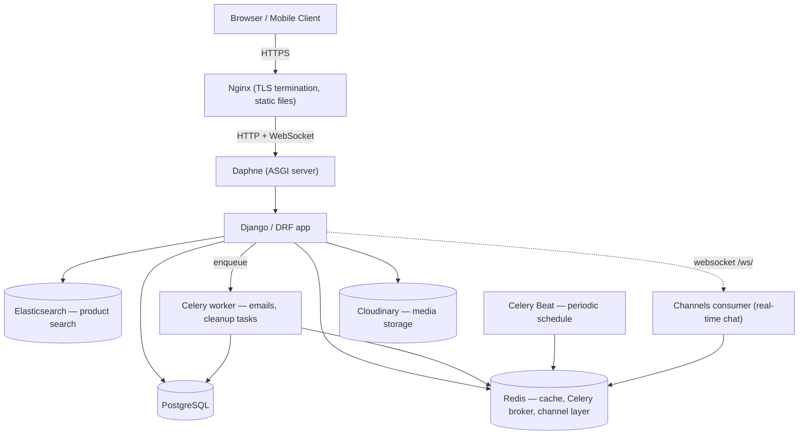
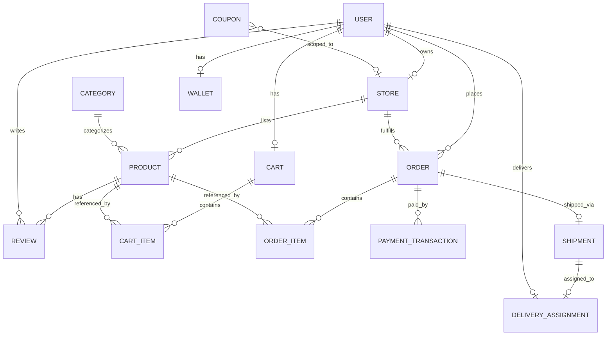

# FaizanMart

A multi-vendor e-commerce platform built with Django REST Framework — vendors run their
own storefronts, customers browse/search/buy across all of them, and a small back office
(admin, warehouse, support, accountant, delivery) runs the operational side.

## Project Overview

FaizanMart models a real marketplace, not a single-store shop: independent vendors
register, get approved, and manage their own catalog and orders; customers get one unified
storefront with cross-vendor search, cart, checkout, reviews, and live chat; and seven
distinct staff roles (super admin, warehouse manager, delivery boy, support staff,
accountant, plus vendor and customer) each see only the slice of the system their role
needs. It's built as a portfolio-grade backend: JWT auth with 2FA, role-based permissions
enforced at the queryset level (not just the endpoint), async email/cleanup via Celery,
Elasticsearch-backed product search with typo tolerance and synonym matching, three
payment gateways, and a security-conscious settings layout (HSTS, CSP, scoped rate
limiting, audit logging) from the start rather than bolted on at the end.

## Features

- **Accounts** — JWT auth (access/refresh, blacklist-on-logout), email verification,
  password reset, Google OAuth, TOTP-based 2FA, per-session device tracking/revocation,
  multiple shipping/billing addresses.
- **Vendors** — self-service registration, admin approval/rejection workflow, storefront
  profile (business/tax/bank info), resubmission after rejection.
- **Catalog** — categories/brands/tags, product variants and specifications, multi-image
  products, vendor-scoped ownership enforced on every write.
- **Search** — Elasticsearch-backed full-text search with typo tolerance, "did you mean"
  suggestions, synonym matching, and natural-language filter extraction (brand/price range
  parsed out of a free-text query).
- **AI Shopping Assistant** — natural-language product search ("laptop under 150,000 for
  programming") via a local, free LLM (Qwen 2.5 through Ollama, no paid API). The model
  only gets to *call a tool* that runs a real Elasticsearch search, and it's explicitly
  forbidden from stating a product's name/price/spec itself — every product in the
  response is a genuine row from the database, never model-invented text. Multi-language:
  works in English, Urdu script, and Roman Urdu, auto-detected per message (detection is
  deterministic, done in code, not left to the model — see
  [apps/assistant/services.py](apps/assistant/services.py)).
- **Inventory** — multi-warehouse stock, reserved-vs-available quantity tracking, low-stock
  alerts.
- **Cart & Coupons** — guest carts (session token) that merge into the account cart on
  login, percentage/fixed/free-shipping coupons scoped to a store or platform-wide.
- **Orders** — server-side-only pricing and shipping cost (client-supplied values are never
  trusted), a validated order-status state machine, per-store order splitting.
- **Payments** — Stripe (PaymentIntents + webhooks), JazzCash & EasyPaisa (hosted
  checkout + callbacks), Cash on Delivery, an internal wallet with top-up/refund-to-wallet.
- **Shipping** — configurable rate rules (by weight/city/store), delivery-boy assignment
  and status tracking, shipment status history.
- **Reviews & Wishlist** — verified-purchase-only reviews, one review per customer per
  product, vendor replies, wishlist toggling.
- **Support** — customer ticketing with staff replies/status transitions, a public FAQ.
- **Notifications** — in-app notifications for order updates and vendor approval events.
- **Analytics** — trending/best-selling products, product-view tracking, per-role
  dashboards (inventory reports for warehouse managers, finance reports for accountants).
- **Marketing** — homepage banners, flash sales with per-product discount percentages.
- **Chat** — real-time customer↔vendor and customer↔support messaging over WebSockets
  (Django Channels), JWT-authenticated socket connections.
- **Site Settings** — a singleton platform-settings record, admin-managed email templates.
- **Security** — HSTS + secure cookies, Content-Security-Policy, scoped DRF throttling
  (separate limits for login/register/OTP/password-reset/checkout/payment), append-only
  audit log of create/update/delete actions with before/after diffs, a dedicated
  [security regression suite](apps/core/tests_security.py).

## Tech Stack

| Layer | Choice |
|---|---|
| Language / Framework | Python 3.13, Django 6.0, Django REST Framework |
| Storefront frontend | Server-rendered Django templates (`apps/storefront`) + Tailwind CSS + vanilla JS `fetch()` against the same DRF API, session-authenticated |
| Auth | `djangorestframework-simplejwt` (JWT + blacklist), Google OAuth, TOTP 2FA |
| Database | PostgreSQL 16 |
| Cache / Broker | Redis 7 |
| Search | Elasticsearch 8 (`django-elasticsearch-dsl`) |
| Async tasks | Celery + Celery Beat |
| Real-time | Django Channels 4 + Daphne (ASGI), `channels_redis` |
| API docs | drf-spectacular (OpenAPI 3 + Swagger UI) |
| Media storage | Cloudinary (falls back to local disk if unconfigured) |
| Static files | WhiteNoise |
| AI | Qwen 2.5 (7B) via [Ollama](https://ollama.com) — local, free, no per-request API cost |
| Payments | Stripe, JazzCash, EasyPaisa |
| Web server (prod) | Nginx → Daphne |
| Containerization | Docker, docker-compose |
| CI | GitHub Actions (lint, test + coverage, Docker build) |

## Architecture



## ER Diagram (core entities)

The full schema spans 17 apps; this is the subset that ties the marketplace together —
see `apps/*/models.py` for the rest (inventory, notifications, marketing, support, chat).



## API Documentation

Interactive OpenAPI 3 docs (Swagger UI) are served at `/api/docs/` once the app is
running (raw schema at `/api/schema/`) — generated automatically from the DRF viewsets
via `drf-spectacular`, so it always matches the code.

## Getting Started

### Prerequisites

- Python 3.13
- Docker + Docker Compose (recommended — see below), or locally installed
  Postgres 16, Redis 7, and Elasticsearch 8

### Option A — Docker (recommended)

```bash
git clone <repo-url> faizanmart && cd faizanmart
cp .env.example .env          # fill in SECRET_KEY at minimum; defaults work for local dev
docker compose up -d --build
docker compose exec web python manage.py createsuperuser   # or: docker compose exec web python manage.py seed_demo
```

App: http://localhost:8000 · API docs: http://localhost:8000/api/docs/ · Admin: http://localhost:8000/admin/

### Option B — Local virtualenv

```bash
python -m venv .venv && source .venv/bin/activate   # .venv\Scripts\activate on Windows
pip install -r requirements.txt
cp .env.example .env
# start Postgres/Redis/Elasticsearch yourself, or: docker compose up -d db redis elasticsearch
python manage.py migrate
python manage.py seed_demo        # optional — see Demo Accounts below
python manage.py runserver
```

Real-time chat needs an ASGI server, not `runserver`:
`daphne -b 0.0.0.0 -p 8000 FaizanMart.asgi:application`

Background jobs (optional for local dev, required for scheduled cleanup tasks):

```bash
celery -A FaizanMart worker -l info
celery -A FaizanMart beat -l info
```

### Running tests

```bash
python manage.py test --settings=FaizanMart.settings.test
```

With coverage:

```bash
coverage run --source=apps --omit='*/migrations/*,*/tests*,*/tests_*' manage.py test --settings=FaizanMart.settings.test
coverage report -m
```

## Storefront

The customer-facing storefront (`apps/storefront`) is server-rendered Django templates —
home, product listing/detail, cart, wishlist, checkout, and order history — styled with
Tailwind CSS. Interactive bits (add to cart, wishlist toggle, live filters, quantity
updates, review submission) call the *same* DRF API the rest of the project already
exposes, via a small vanilla-JS `fetch()` wrapper (`apps/storefront/static/storefront/js/`)
authenticated with the normal Django session cookie + CSRF token — no separate JWT
handling needed for same-origin browser requests (`rest_framework.authentication.
SessionAuthentication` is enabled alongside JWT for exactly this).

Registration, login, 2FA, and password reset reuse the existing session-based views in
`apps/accounts/views.py`.

### Building the CSS

Tailwind is compiled with the [standalone CLI](https://tailwindcss.com/blog/standalone-cli)
(a single binary — no Node/npm required). One-time setup:

```bash
curl -fL -o bin/tailwindcss.exe https://github.com/tailwindlabs/tailwindcss/releases/latest/download/tailwindcss-windows-x64.exe
# macOS: .../tailwindcss-macos-x64 (or -arm64)  ·  Linux: .../tailwindcss-linux-x64
```

Then, whenever `static_src/css/input.css` or a template's class names change:

```bash
./bin/tailwindcss -i ./static_src/css/input.css -o ./static/css/output.css   # one-off
./bin/tailwindcss -i ./static_src/css/input.css -o ./static/css/output.css --watch  # dev
./bin/tailwindcss -i ./static_src/css/input.css -o ./static/css/output.css --minify # prod
```

Static files use WhiteNoise's `CompressedManifestStaticFilesStorage`, which is
manifest-strict — after touching *any* file under `static/` or an app's `static/`
directory (new JS file, rebuilt CSS), re-run `collectstatic` or `` will 404
on files missing from the manifest:

```bash
python manage.py collectstatic --noinput
```

## AI Shopping Assistant

```bash
# 1. Install Ollama: https://ollama.com/download
# 2. Pull the model (~4.7GB, one-time):
ollama pull qwen2.5:7b
# 3. Make sure it's running (it usually auto-starts as a background service):
ollama serve

# 4. Ask it something:
curl -X POST http://localhost:8000/api/assistant/query/ \
  -H "Content-Type: application/json" \
  -d '{"query": "laptop under 150000 for programming"}'
```

If Ollama isn't running or isn't reachable, the endpoint doesn't error out — it falls back
to a direct Elasticsearch search on the raw query text (`"ai_generated": false` in the
response tells the frontend which mode it got). Running via `docker compose`, the `web`
container reaches Ollama on the host through `host.docker.internal` automatically (see
`OLLAMA_URL` in `docker-compose.yml`).

## Environment Variables

All variables are documented inline in [.env.example](.env.example) (local dev) and
[.env.prod.example](.env.prod.example) (production). Summary:

| Variable | Purpose |
|---|---|
| `SECRET_KEY`, `DEBUG`, `DJANGO_SETTINGS_MODULE`, `ALLOWED_HOSTS` | Core Django config |
| `DATABASE_URL`, `POSTGRES_*` | PostgreSQL connection |
| `REDIS_URL`, `CELERY_BROKER_URL`, `CELERY_RESULT_BACKEND` | Cache / async tasks |
| `ELASTICSEARCH_URL` | Product search backend |
| `CORS_ALLOWED_ORIGINS` | Allowed frontend origin(s) |
| `CLOUDINARY_URL` | Media storage (blank = local filesystem) |
| `EMAIL_HOST_USER`, `EMAIL_HOST_PASSWORD`, `EMAIL_HOST_NAME` | Verification / reset emails |
| `GOOGLE_OAUTH_CLIENT_ID` | Google sign-in |
| `STRIPE_*` | Stripe payments + webhook verification |
| `JAZZCASH_*`, `EASYPAISA_*` | Pakistani mobile-wallet payment gateways |
| `OLLAMA_URL`, `OLLAMA_MODEL`, `OLLAMA_TIMEOUT_SECONDS` | AI shopping assistant (local LLM) |

## Docker Setup

`docker-compose.yml` runs the full stack: `web` (Daphne), `celery`, `celery-beat`, `db`
(Postgres), `redis`, and `elasticsearch`. For production, layer
`docker-compose.prod.yml` on top (removes dev bind-mounts, stops publishing
db/redis/ES ports to the host):

```bash
docker compose -f docker-compose.yml -f docker-compose.prod.yml up -d --build
```

See [deploy/](deploy/) for the accompanying Nginx reverse-proxy config
([deploy/nginx.conf](deploy/nginx.conf) — TLS termination, static/media serving, WebSocket
proxying) and automated Postgres backup script ([deploy/backup_db.sh](deploy/backup_db.sh)).

## CI/CD

GitHub Actions ([.github/workflows/ci.yml](.github/workflows/ci.yml)) runs on every push
and PR to `main`: `flake8` lint → full test suite with coverage (against real
Postgres/Redis/Elasticsearch service containers) → Docker image build. A deploy job is
stubbed in and commented out pending a hosting target.

## Demo Accounts

Seed them locally with `python manage.py seed_demo` (idempotent — safe to re-run). All
accounts share the password below.

| Role | Email | Password |
|---|---|---|
| Admin | `admin@faizanmart.site` | `Demo@12345` |
| Vendor | `vendor@faizanmart.site` | `Demo@12345` |
| Customer | `customer@faizanmart.site` | `Demo@12345` |
| Delivery Boy | `delivery@faizanmart.site` | `Demo@12345` |

The seed also creates an approved demo store ("Faizan Electronics") with a few published
products so there's something to browse/order immediately.

## Live Demo

Not yet deployed — see the production configs in [deploy/](deploy/) and
[docker-compose.prod.yml](docker-compose.prod.yml) for what's ready to go once a hosting
target is chosen.

## License

Portfolio project — no license granted for reuse.
